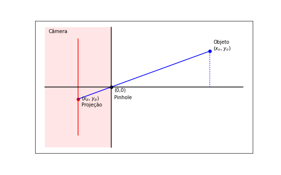

# APS4_ALGLIN

Esse é um projeto da matéria de Algebra Linear e Teoria da Informação do Insper para o curso de Ciência da Computação.

# Projeto: a projeção 3D de um cubo
Neste projeto, utilizamos a biblioteca `pygame`, usando a função `pygame.draw.line` para desenhar as linhas na tela. Ademais, as transformações foram implementadas manualmente.

## Descrição do Projeto
O projeto consiste em fazer a implementação da projeção de um mundo 3D em uma tela 2D usando o algoritmo da pinhole camera. No qual o objetivo deste projeto é fazer uma projeção em tempo real de um cubo em *wireframe* que gira em todas as direções das três dimensões.

## Descrição Matemática 

O modelo matemático utilizado para o desenvolvimento do projeto foi baseado no experimento da câmera pinhole, que consiste em mostrar de maneira simples como as imagens são formadas. Geometricamente, nós conseguimos representar esse experimento em um plano cartesiano $x,y$, como na imagem abaixo:




Já que estamos tratando de um plano de duas dimensões, o vetor de coordenadas é do tipo:

$$
\begin{bmatrix}
x_o\\
y_o\\
1
\end{bmatrix}
$$

Na imagem, conseguimos visualizar o objeto na coordenada $[x_o,y_o]$, o pinhole que está na coordenada $[0,0]$ e a imagem projetada, que se situa na coordenada $[x_p,y_p]$. Já que queremos encontrar o ponto $[x_p,y_p]$, podemos utilizar a seguinte dedução:

- A distância entre a imagem projetada e o pinhole é $d$ (distância focal), então podemos concluir que $x_p=-d$.


Através de semelhança de triângulos, podemos encontrar a razão entre as coordenadas $X$ e $Y$ da imagem e do objeto:

$$
\frac{y_p}{x_p} = \frac{y_o}{x_o}
$$

Logo, podemos substituir $x_p$ por $-d$ e encontrar a igualdade da coordenada $Y_p$:

$$
Y_p = \frac{y_o}{x_o}(-d)
$$

Como queremos fazer transformações matriciais para a projeção, nós precisamos converter as coordenadas dos pontos em coordenadas homogêneas. Para isso, basta adicionar uma variável auxiliar, no exemplo vamos utilizar a variável $w_p$, de tal forma que:

$$ x_p w_p = x_o $$

Nós sabemos que, para chegar em uma matriz de transformação linear:

$$
\begin{bmatrix}
x_p * w_p\\
y_p\\
w_p
\end{bmatrix} =
M_t
\begin{bmatrix}
x_o\\
y_o\\
1
\end{bmatrix}
$$

Portanto, através da utilização da variável auxiliar e da dedução da multiplicação matricial, podemos escrever a matriz de projeção do espaço bi-dimensional para o unidimensional como:

$$
M_t = 
\begin{bmatrix}
1 & 0 & 0\\
0 & 0 & -d\\
0 & -1/d & 0
\end{bmatrix}
$$

Aplicar essa teoria em um plano tridimensional não é muito diferente, precisamos definir o pinhole no ponto $[0,0,0]$, já que agora nós estamos nos referindo em um plano de três dimensões, o vetor de coordenadas é do tipo:

$$
\begin{bmatrix}
x_o\\
y_o\\
z_o\\
1
\end{bmatrix}
$$

A nova matriz de projeção do plano de três dimensões para o bi-dimensional é dada por:

$$
M_t =
\begin{bmatrix}
1 & 0 & 0 & 0\\
0 & 1 & 0 & 0\\
0 & 0 & 0 & -d\\
0 & 0 & -1/d & 0
\end{bmatrix}
$$

E a nova matriz resultante da multiplicação matricial é:

$$
\begin{bmatrix}
x_p * w_p\\
y_p * w_p\\
z_p\\
w_p
\end{bmatrix} 
$$

## Implementação

-Primeiramente nós definimos um array através da biblioteca numpy representando todos os pontos do cubo, onde cada coluna é um vértice do cubo e a linhas representam as dimensões x,y,z de cada vértice, respectivamente. O array representa o cubo nas três dimensões com arestas paralelas aos eixos x, y e z, cujos vértices estão localizados nos seguintes pontos:

- (-100, -100, -100): canto inferior esquerdo da face frontal.

- (100, -100, -100): canto inferior direito da face frontal.

- (100, 100, -100): canto superior direito da face frontal.

- (-100, 100, -100): canto superior esquerdo da face frontal.

- (-100, -100, 100): canto inferior esquerdo da face traseira.

- (100, -100, 100): canto inferior direito da face traseira.

- (100, 100, 100): canto superior direito da face traseira.

- (-100, 100, 100): canto superior esquerdo da face traseira.

ou seja, a matriz: 

$$
\begin{bmatrix}
-100 & 100 & 100 & -100 & -100 & 100 & 100 & -100\\
-100 & -100 & 100 & 100 & -100 & -100 & 100 & 100\\
-100 & -100 & -100 & -100 & 100 & 100 & 100 & 100\\
1 & 1 & 1 & 1 & 1 & 1 & 1 & 1\\
\end{bmatrix}
$$

- Após isso, criamos uma matriz de projeção pinhole que depende da distância focal $d$ (já foi mostrada anteriormente).

- Definimos as matrizes de rotação para cada dimensão $x,y,z$:

$$
R_x = \begin{bmatrix}
1 & 0 & 0 & 0 \\
0 & \cos(\theta) & -\sin(\theta) & 0 \\
0 & \sin(\theta) & \cos(\theta) & 0 \\
0 & 0 & 0 & 1
\end{bmatrix}
\hspace{0.5in}
R_y = \begin{bmatrix}
\cos(\theta) & 0 & \sin(\theta) & 0 \\
0 & 1 & 0 & 0 \\
-\sin(\theta) & 0 & \cos(\theta) & 0 \\
0 & 0 & 0 & 1
\end{bmatrix}
\hspace{0.5in}
R_z = \begin{bmatrix}
\cos(\theta) & - \sin(\theta) & 0 & 0 \\
\sin(\theta) & \cos(\theta) & 0 & 0 \\
0 & 0 & 1 & 0 \\
0 & 0 & 0 & 1
\end{bmatrix}
$$

- É definida uma matriz de rotação total, que é o resultado da multiplicação das três matrizes de rotação, essa matriz é incrementada através de multiplicação matricial dependendo do input do usuário (se ele quer que o cubo gire no eixo x,y ou z):

```py
# Matriz de rotação total
r = x @ y @ z
```

Caso o usuário queira que o cubo rotacione no eixo x, a matriz rotação será incrementada da seguinte forma:

```py
r = r @ x
```

Além disso, caso o usuário queira que o cubo rotacione no eixo y, a matriz rotação será incrementada da seguinte forma:

```py
r = r @ y
```
E por fim, caso o usuário queira que o cubo rotacione no eixo z, a matriz rotação será incrementada da seguinte forma:

```py
r = r @ x
```

- É definida uma matriz de translação no eixo z, para que a visualização do cubo seja "de fora" da câmera, para isso, o cubo é transladado uma distância $d$ no eixo z. 

$$
\begin{bmatrix}
1 & 0 & 0 & 0\\
0 & 1 & 0 & 0\\
0 & 0 & 1 & d\\
0 & 0 & 0 & 1\\
\end{bmatrix}
$$

- É definida uma matriz de translação que translada o cubo para o centro original, do tipo:

$$
\begin{bmatrix}
1 & 0 & 0 & 400\\
0 & 1 & 0 & 300\\
0 & 0 & 1 & 0\\
0 & 0 & 0 & 1\\
\end{bmatrix}
$$

Após todos esse passos, concluimos a implementação definindo uma matriz de transformação total e fazemos uma multiplicação matricial entre essa matriz resultante e o vetor de coordenadas do cubo.

```py
# Matriz de transformação total do cubo
M = Tc @ pinhole  @ Tz @ r

# Cubo com as transformações aplicadas
cubo_final = M @ cubo
```

Observação:

Essa sequencia de multiplicação matricial para chegar na matriz de transformação total é feita da maneira que, o cubo seja primeiramente rotacionado em algum ou todos os eixos, lembrando que para isso ele deve estar na coordendada $(0,0,0)$. Após isso o cubo é transladado no eixo z para que possa ser visto de fora da câmera, após isso é feita a multiplicação matricial pela matriz de projeção pinhole, e por fim o cubo é transladado ao centro da tela pela matriz $T_c$.


Por fim, é chamado o método pygame.draw.line() para desenhar as 12 arestas do cubo:

- Para desenhar cada linha, as coordenadas dos dois vértices que a linha conecta são divididas pelas suas coordenadas homogêneas (o último elemento da coluna correspondente) para obter as coordenadas normalizadas em relação ao plano de projeção. Essas coordenadas normalizadas são então usadas como argumentos para a função pygame.draw.line() para desenhar a linha.

```py
# Cria linhas que ligam os pontos do cubo, transforma o XpWp em Xp e/ou YpWp em Yp
pygame.draw.line(screen, cor, (cubo_final[0, 0]/cubo_final[3, 0], cubo_final[1, 0]/cubo_final[3, 0]), (cubo_final[0, 1]/cubo_final[3, 1], cubo_final[1, 1]/cubo_final[3, 1]), 3)
```

## Como rodar o projeto e Funcionalidades

O projeto foi feito em Python e utiliza as bibliotecas `pygame` e `numpy`.

### Clone o repositório do nosso projeto:

```py
https://github.com/WeeeverAlex/thecube
```

### Depois instale os requirements:

```py
pip install -r requirements.txt
```

## Por fim, basta executar o arquivo cubo.py: 

```py
python cubo.py
```

O projeto possui as seguintes funcionalidades:

- Rotação do cubo em torno do eixo x caso o usuário aperte a tecla `x`. 
- Rotação do cubo em torno do eixo y caso o usuário aperte a tecla `y`.
- Rotação do cubo em torno do eixo z caso o usuário aperte a tecla `z`.
- Rotação do cubo nos três eixos caso o usuário aperte a tecla `r`.
- Aumento da distância focal caso o usuário aperte a tecla `s`.
- Diminuição da distância focal caso o usuário aperte a tecla `w`.

## Resultado final


## Autores

- [@st4pzz](https://github.com/st4pzz)
- [@WeeeverAlex](https://github.com/WeeeverAlex)
